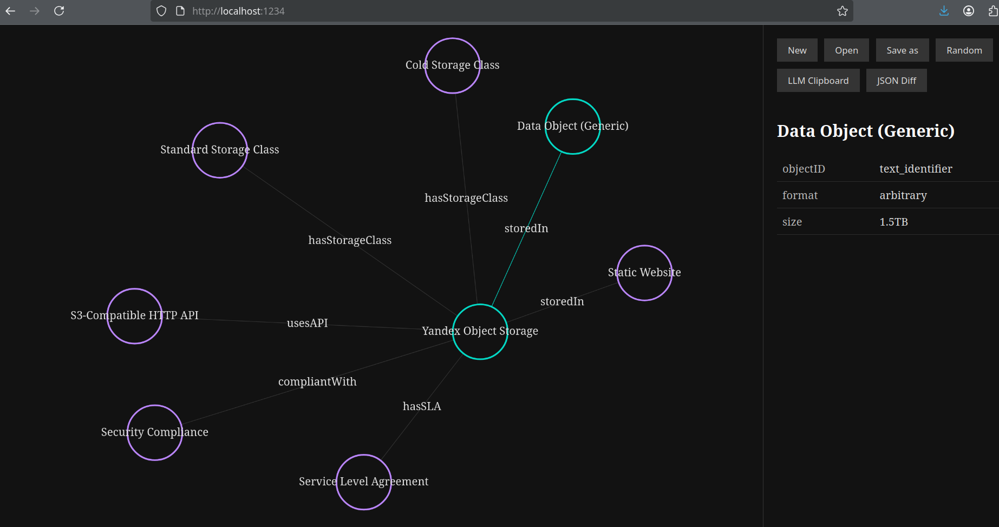

# Logico2

Logico2 is a React-based application for creating and visualizing formal graphs based on LLM text processing.

## Features

- Visualize formal graphs with interactive graph components
- Save and load graph configurations
- Generate random graphs for testing
- Responsive design for desktop and mobile
- Text processing capabilities for creating graphs from LLM outputs



## Project Structure

```
back/                  # Backend directory
├── Dockerfile         # Docker configuration for backend
├── main.py            # Main backend application
├── requirements.txt   # Python dependencies
front/                 # Frontend directory
├── babel.config.json  # Babel configuration
├── jest.config.js     # Jest configuration
├── jest.setup.js      # Jest setup file
├── LICENSE            # License file
├── package.json       # NPM package configuration
├── README.md          # Frontend README
├── yarn.lock          # Yarn lock file
├── prompt/            # Prompt files for text processing
│   ├── extractAndApplyGraphChanges.txt
│   ├── extractSimpleClass.txt
│   ├── jsonDiff.txt
├── public/            # Public assets
│   ├── index.html     # Main HTML file
├── src/               # Source code
│   ├── app.js         # Main application file
│   ├── index.js       # Entry point
│   ├── components/    # React components
│   │   ├── Button.jsx
│   │   ├── ButtonPanel.jsx
│   │   ├── ClipboardPanel.jsx
│   │   ├── JsonDiffPanel.jsx
│   │   ├── RightPanel.jsx
│   │   ├── buttonPanel.css
│   │   ├── clipboardPanel.css
│   │   ├── jsonDiffPanel.css
│   │   ├── rightPanel.css
│   ├── constants/     # Shared constants and configuration
│   │   ├── appConstants.js
│   ├── effects/       # Event handlers and side effects
│   │   ├── index.js
│   │   ├── json.js
│   │   ├── new.js
│   │   ├── open.js
│   │   ├── random.js
│   │   ├── saveAs.js
│   ├── utils/         # Utility functions
│   │   ├── clipboardUtil.js
│   │   ├── fileUtil.js
│   │   ├── graphUtil.js
├── tests/             # Tests
│   ├── integration/   # Integration tests
│   │   ├── app.test.js
│   ├── unit/          # Unit tests
│   │   ├── button.test.js
│   │   ├── buttonPanel.test.js
│   │   ├── ClipboardPanel.test.js
│   │   ├── clipboardUtil.test.js
│   │   ├── graphUtil.test.js
│   │   ├── jsonEffect.test.js
│   │   ├── newEffect.test.js
│   │   ├── openEffect.test.js
│   │   ├── randomEffect.test.js
│   │   ├── rightPanel.test.js
│   │   ├── saveAsEffect.test.js
│   │   ├── saveRestoreAllValues.test.js
docker-compose.yml     # Docker Compose configuration
.gitignore             # Git ignore file
ollama/                # Ollama configuration and models
├── id_ed25519
├── id_ed25519.pub
├── models/
│   ├── blobs/
│   ├── manifests/
```

## Installation

### Using Docker Compose (Recommended)

1. Clone the repository:
   ```
   git clone https://github.com/glad4enkonm/logico2.git
   cd logico2
   ```

2. Start the application using Docker Compose:
   ```
   docker-compose up
   ```

   This will start both the backend and frontend services.

### Manual Installation

1. Clone the repository:
   ```
   git clone https://github.com/glad4enkonm/logico2.git
   cd logico2
   ```

2. Install backend dependencies:
   ```
   cd back
   pip install -r requirements.txt
   ```

3. Install frontend dependencies:
   ```
   cd ../front
   yarn install
   ```

4. Start the development servers:
   ```
   # In one terminal, start the backend
   cd ../back
   python main.py

   # In another terminal, start the frontend
   cd ../front
   yarn start
   ```

## Build

To create a production build:

```
cd front
yarn build
```

## Testing

To run tests:

```
cd front
yarn test
```

To run tests in watch mode:

```
cd front
yarn test:watch
```


## Dependencies

- React 18
- G6 (AntV Graph) for graph visualization
- Parcel for bundling
- Babel for transpiling
- Jest for testing

## License

MIT
