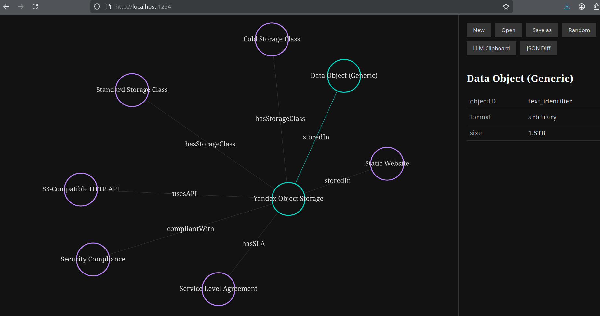

# Logico2

Logico2 is a React-based application for creating and visualizing formal graphs based on LLM text processing.

## Features

- Visualize formal graphs with interactive graph components
- Save and load graph configurations
- Generate random graphs for testing
- Responsive design for desktop and mobile
- Text processing capabilities for creating graphs from LLM outputs



## Project Structure

```
src/
├── components/       # React components
├── constants/        # Shared constants and configuration
├── config/           # Environment variables and configuration
├── effects/          # Event handlers and side effects
├── utils/            # Utility functions
├── app.js            # Main application file
├── index.js          # Entry point
public/
├── index.html        # Main HTML file
```

## Installation

1. Clone the repository:
   ```
   git clone https://github.com/glad4enkonm/logico2.git
   cd logico2
   ```

2. Install dependencies:
   ```
   yarn install
   ```

3. Start the development server:
   ```
   yarn start
   ```

## Build

To create a production build:
```
yarn build
```

## Testing

To run tests:
```
yarn test
```

To run tests in watch mode:
```
yarn test:watch
```

## Linting and Formatting

To lint the code:
```
yarn lint
```

To format the code:
```
yarn format
```


## Dependencies

- React 18
- G6 (AntV Graph) for graph visualization
- Parcel for bundling
- Babel for transpiling
- Jest for testing

## License

MIT
